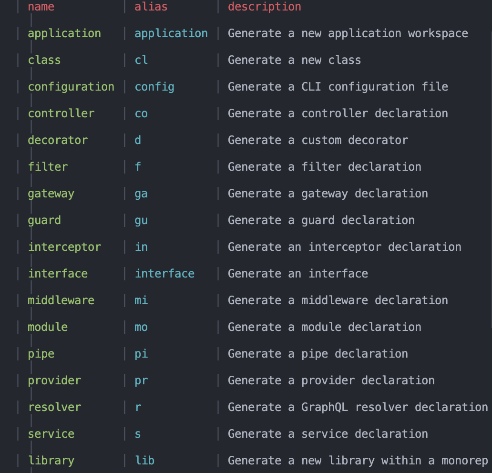

# [NestJs Zero to Hero](https://www.udemy.com/course/nestjs-zero-to-hero/learn/lecture/26680748#overview)

- [NestJs Zero to Hero](#nestjs-zero-to-hero)
  - [CLI Generation](#cli-generation)
  - [Modules](#modules)
  - [Controllers](#controllers)
    - [What is it?](#what-is-it)
      - [Request Method are](#request-method-are)
      - [Best Practice](#best-practice)
    - [Implement a controller](#implement-a-controller)
    - [What are handles and how to implement them?](#what-are-handles-and-how-to-implement-them)
      - [Handler life cycle](#handler-life-cycle)
    - [Controller examples](#controller-examples)
  - [Providers](#providers)
    - [Services](#services)
    - [Example](#example)
    - [Injecting the providers](#injecting-the-providers)
  - [DTOs (Data Transfer Objects)](#dtos-data-transfer-objects)
    - [Workflow without DTOs](#workflow-without-dtos)
    - [Qualities](#qualities)
      - [Interface vs Class](#interface-vs-class)
      - [Examples](#examples)
  - [Pipes](#pipes)
    - [What are pipes?](#what-are-pipes)
    - [Custom Pipes](#custom-pipes)
    - [Consuming pipes](#consuming-pipes)
      - [Handler-level pipes](#handler-level-pipes)
      - [Parameter-level pipes](#parameter-level-pipes)
      - [Global pipes](#global-pipes)
      - [Parameter-level VS Handler-level pipes. Which one?](#parameter-level-vs-handler-level-pipes-which-one)
    - [Pipe flow](#pipe-flow)
    - [Validation Pipe](#validation-pipe)
  - [Typescript](#typescript)
    - [The private/public keyword in the constructor is a nice syntactic sugar](#the-privatepublic-keyword-in-the-constructor-is-a-nice-syntactic-sugar)
      - [Without it](#without-it)
      - [With it](#with-it)
  - [UUID](#uuid)

## CLI Generation

`nest g --help` to get a list of available template generations.

Note that `--no-spec` disables generating a test file.

## Modules

## Controllers

Its only job is to receive the request and send the response.

### What is it?

#### [Request Method are](https://developer.mozilla.org/en-US/docs/Web/HTTP/Methods)

Set of request methods that indicate the desired action.

- GET
  - The GET method requests a representation of the specified resource. Requests using GET should only retrieve data.
- HEAD
  - The HEAD method asks for a response identical to a GET request, but without the response body.
- POST
  - The POST method submits an entity to the specified resource, often causing a change in state or side effects on the server.
- PUT
  - The PUT method **replaces all** current representations of the target resource with the request payload.
- DELETE
  - The DELETE method deletes the specified resource.
- CONNECT
  - The CONNECT method establishes a tunnel to the server identified by the target resource.
- OPTIONS
  - The OPTIONS method describes the communication options for the target resource.
- TRACE
  - The TRACE method performs a message loop-back test along the path to the target resource.
- PATCH
  - The PATCH method applies **partial modifications** to a resource.
  - 
  - specify the patched in the URL is **not currently follow by Echelon**.

#### Best Practice

### Implement a controller

### What are handles and how to implement them?

#### Handler life cycle

### Controller examples

## Providers

### Services

Not all Services are providers

### Example

Implementation of providers

### Injecting the providers

The @Injectable decorated makes the class singleton.

## DTOs (Data Transfer Objects)

A data fransfer object (DTO) is define the data type and validates it.

### Workflow without DTOs

/dto-exist-because-data-description-get-out-of-hand-in-scale.png)

### Qualities

It defines the shape of data **for a specific case.**

/pros.png)

#### Interface vs Class

You can refer to classes in run time while interfaces you cannot.

/classes-vs-interfaces.png)

#### Examples

/examples.png)

Data transfer objects are **not mandatory** but applying them as soon as possible will **makes it easier to maintain and refactor** your code.

## Pipes

### What are pipes?

### Custom Pipes

### Consuming pipes

#### Handler-level pipes

#### Parameter-level pipes

#### Global pipes

#### Parameter-level VS Handler-level pipes. Which one?

### Pipe flow

### Validation Pipe

Lets the DTOs files handle the validation.

To use the validation pipe you need packages:
- class-validator
- class-transformer

Recommended to consume the validation pipes globally.

## Typescript

### The private/public keyword in the constructor is a nice syntactic sugar

#### Without it

#### With it

## UUID

- What is a UUID?
  - A universally unique identifier (UUID) is a 128-bit number used to identify information in computer systems.
  - <https://www.youtube.com/watch?v=w0VFcVYIfhg>
- Auto increment vs UUID
  - <https://www.youtube.com/watch?v=s5Im6LWfLrY>
